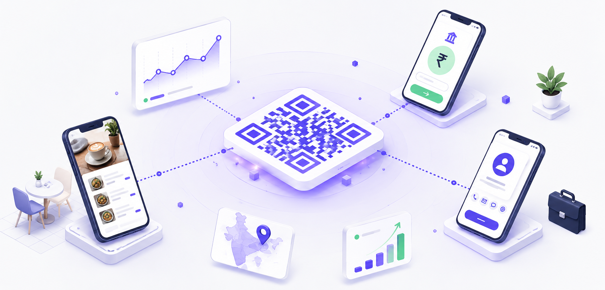
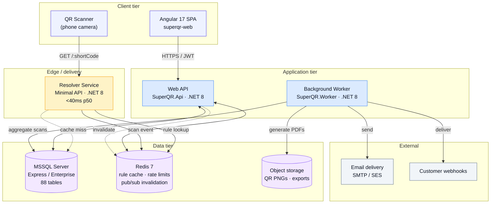
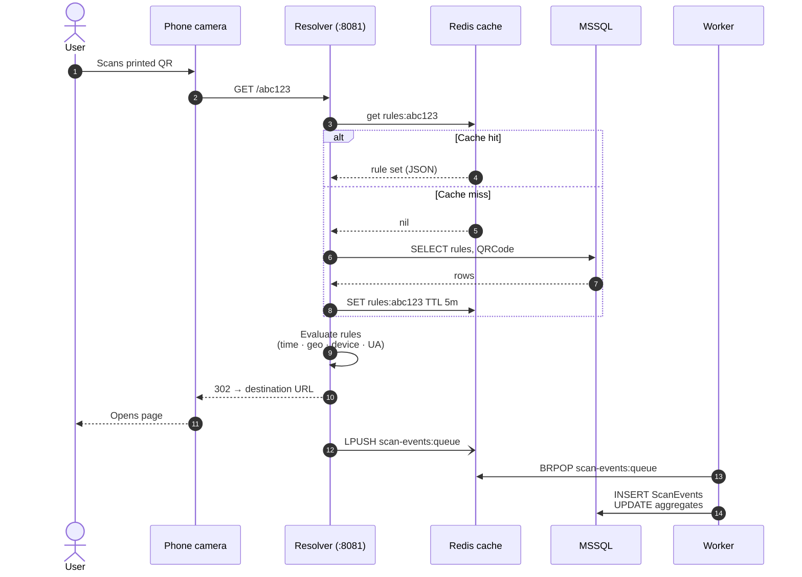
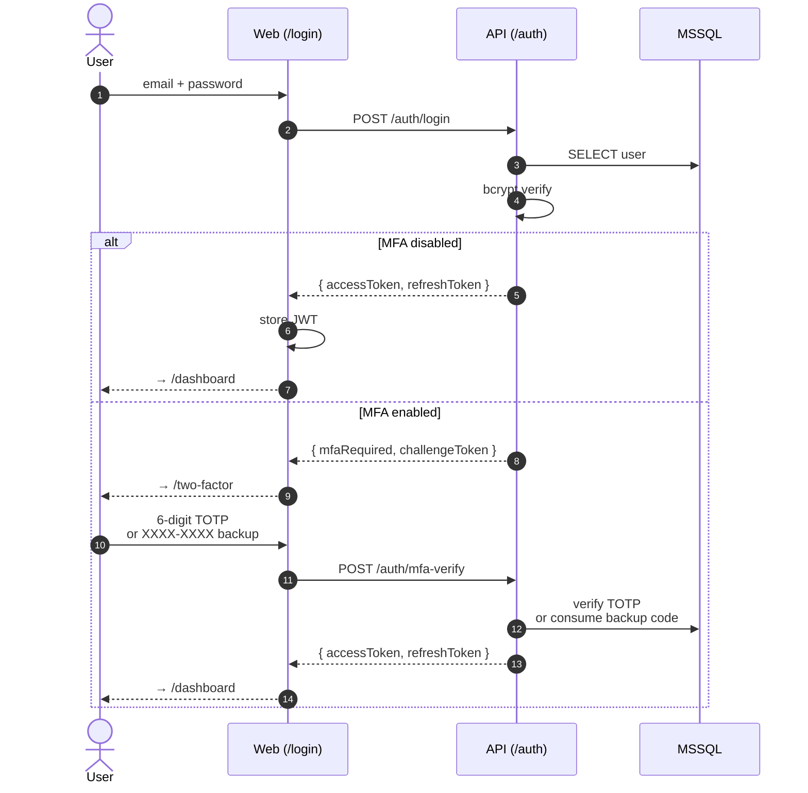
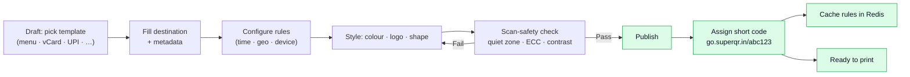

<div align="center">





# Super QR

**Dynamic, multi-tenant QR-code SaaS built for Indian SMBs and enterprises.**
_One printed QR that adapts to time, place, and person._

[](#license)
[](#roadmap)
[](#roadmap)
[](#)

<br/>

[](https://dotnet.microsoft.com/)
[](#)
[](https://angular.io/)
[](#)
[](https://tailwindcss.com/)
[](#)
[](#)
[](#)
[](#)
[](#)
[](#)
[](#)
[](#)

</div>

---

## Table of contents

- [What is Super QR?](#what-is-super-qr)
- [Feature highlights](#feature-highlights)
- [System architecture](#system-architecture)
- [Application flows](#application-flows)
- [Tech stack](#tech-stack)
- [Repository layout](#repository-layout)
- [Getting started](#getting-started)
- [Environment configuration](#environment-configuration)
- [API surface](#api-surface)
- [Roadmap](#roadmap)
- [Screenshots](#screenshots)
- [License](#license)

---

## What is Super QR?

Super QR is a **dynamic QR-code platform** that lets a printed code do something different based on **who scans it, when, and where**. A single QR printed on a table tent can show a lunch menu at noon and an à-la-carte menu at 8 PM. A single QR on a warranty card can route Mumbai scanners to a Hindi microsite and Bengaluru scanners to an English one.

The platform is **multi-tenant** with strict workspace isolation, enterprise features (SSO, 2FA, GST-compliant billing, audit trails, DPDP compliance) and India-first defaults (Mumbai data residency, INR pricing, CGST/SGST/IGST invoicing, UPI/WhatsApp/vCard templates).

**Who it's for:** QSR chains, hotels, retailers, event organisers, product manufacturers, and marketing agencies who print QR codes at scale and want them to keep working — and keep evolving — long after the print run ships.

---

## Feature highlights

| Category | Capabilities |
|---|---|
| **Dynamic routing** | Time-of-day rules, geo-fencing (city / region / country), device / OS targeting, user-agent rules, A/B experiments with Bayesian (Beta-Binomial Monte-Carlo) analysis |
| **QR generation** | 15 vertical templates (menu, vCard, Wi-Fi, UPI, WhatsApp, product, warranty, event, coupon, review, feedback, checkin, PDF, MP3, YouTube), static + dynamic modes, custom styling, logo overlay, scan-safety scoring |
| **Analytics** | Real-time scan events, city/device/OS/referrer breakdowns, time-of-day heatmaps, funnel + cohort analysis, exportable CSV / PDF |
| **Landing pages** | Micro-site builder for menus, vCards, event pages, product info — with drag-and-drop blocks and template themes |
| **Bulk generation** | CSV upload → thousands of unique dynamic QRs, print-ready PDF sheets, printer-safe export (300 DPI, quiet-zone enforced) |
| **Billing (India-first)** | Free / Pro / Business / Enterprise plans, GST-compliant invoices with CGST/SGST/IGST split by place of supply, subscription lifecycle, dunning |
| **Security** | JWT auth, bcrypt password hashing, TOTP 2FA (RFC 6238), 10 one-time backup recovery codes, active session management, rate-limited resolver, URL safety scanning |
| **Multi-tenancy** | Workspace isolation via `WorkspaceId` on every row, role-based membership (owner / admin / member / viewer), invitation flow, audit log |
| **Integrations** | Webhooks with HMAC-SHA256 signatures + delivery retries, REST API for external systems, Salesforce/Freshsales (Sprint 5), Shiprocket/Delhivery (Sprint 6) |
| **Compliance** | DPDP-compliant data handling, AES-256 encryption at rest, TLS 1.3 in transit, Mumbai data residency, SOC 2 Type I roadmap |

---

## System architecture



**Design decisions:**

- **Resolver is a separate service** from the main API. It's the only public-facing hot path and is optimised for sub-40ms p50 latency: read-through Redis cache, minimal-API endpoints, no MVC pipeline, no auth middleware.
- **Rule cache invalidation via Redis pub/sub.** When a user updates a rule in the API, it publishes `rule:invalidate:{qrId}` and every Resolver instance drops the affected key from its local cache.
- **Background worker owns everything asynchronous** — scan-event batch aggregation, GST PDF generation with QuestPDF, webhook delivery with exponential backoff, email queue.
- **Workspace isolation is enforced at the query level** via a `WorkspaceAccessor` service that reads `wsid` from the JWT and injects it into every EF Core query filter. No table can be queried without a workspace context.

---

## Application flows

### Scan resolution (hot path — <40ms p50)



### Sign-in with 2FA



### Dynamic QR creation



---

## Tech stack

### Backend

| Layer | Technology |
|---|---|
| Runtime | **.NET 8** (LTS) |
| Language | **C# 12** with nullable reference types, records, pattern matching |
| Web API | ASP.NET Core (Controllers + Minimal API) |
| ORM | **Entity Framework Core 8** with `SuperQRDbContext` (88 entities) |
| Database | **Microsoft SQL Server** (Express dev / Enterprise prod) |
| Cache | **Redis 7** — rule cache, pub/sub invalidation, token-bucket rate limiter, scan-event queue |
| Auth | JWT (HS256) with 60-min access + rotating refresh, `MapInboundClaims=false` for clean `sub` claims |
| 2FA | **Otp.NET** for RFC 6238 TOTP, single-use backup codes hashed with SHA-256 |
| Password hashing | **BCrypt.Net** (work factor 11) |
| QR generation | **QRCoder** (PNG + SVG output, custom colours, ECC L/M/Q/H) |
| PDF | **QuestPDF** (Community License) for GST invoices |
| Statistics | Bayesian Beta-Binomial Monte-Carlo (8000 samples, Marsaglia-Tsang Gamma sampler) for A/B analysis |

### Frontend

| Layer | Technology |
|---|---|
| Framework | **Angular 17** with standalone components and signals |
| Styling | **Tailwind CSS 3** with a custom design system |
| Language | **TypeScript 5** with strict mode |
| Forms | Angular Forms + FormsModule (template-driven) |
| Router | Angular Router with lazy-loaded route components |
| Component style | 3-file components (`.ts` + `.html` + `.css`) with `templateUrl` / `styleUrls` |

### Design system

- **Brand:** `brand-500 #4F3DF5` (indigo), `ink-900 #0B1220` (deep navy)
- **Semantic:** `mint-500 #12B76A` (success), `amber-400 #F59E0B` (warning), `rose-500 #F43F5E` (error)
- **Type:** `Space Grotesk` display, `Inter` body, `IBM Plex Mono` numeric
- **Signature motif:** `.finder` pseudo-elements — QR finder-corner brackets used on cards and buttons

### Infrastructure

| Concern | Technology |
|---|---|
| Container runtime | **Docker Desktop** (Windows/macOS/Linux) |
| Orchestration | **Docker Compose v2** |
| Services | `api`, `resolver`, `worker`, `web`, `redis` (host MSSQL) |
| Host networking | `host.docker.internal` for MSSQL over dynamic TCP port |
| Reverse proxy | (production) nginx / Caddy — not yet configured |

---

## Repository layout

```
Super QR/
├── src/
│   ├── backend/src/
│   │   ├── SuperQR.Api/              # Main REST API + controllers
│   │   ├── SuperQR.Contracts/        # Shared DTOs (records)
│   │   ├── SuperQR.Domain/           # Entities (no EF deps)
│   │   ├── SuperQR.Infrastructure/   # EF Core DbContext + mappings
│   │   ├── SuperQR.Resolver/         # Minimal-API redirect service
│   │   └── SuperQR.Worker/           # Hosted background services
│   └── frontend/superqr-web/         # Angular 17 app
│       └── src/app/
│           ├── layout/               # Shell, sidebar, topbar
│           ├── pages/                # Route components (3-file each)
│           │   ├── login/            # login.component.{ts,html,css}
│           │   ├── register/
│           │   ├── forgot-password/
│           │   ├── reset-password/
│           │   ├── two-factor/
│           │   ├── security/
│           │   ├── dashboard/
│           │   ├── qr-codes/
│           │   ├── analytics/
│           │   ├── billing/
│           │   └── …
│           └── services/             # ApiService, interceptors
├── db/
│   ├── 01-SuperQR-Schema.sql         # 88-table schema (idempotent)
│   ├── 02-SuperQR-Seed.sql           # Plans, templates, feature flags, execution days
│   └── 03-Sprint1-4-Backfill.sql     # Marks Sprints 1–4 as delivered
├── docker/                           # Dockerfiles per service
├── admin/                            # Static SaaS operator admin prototype
├── docker-compose.yml                # Local dev orchestration
├── execution-tracker.html            # Day-by-day sprint progress tracker
└── *.html                            # Static prototype pages (design reference)
```

---

## Getting started

### Prerequisites

- **Docker Desktop 24+** with Compose v2
- **Microsoft SQL Server Express** (or Developer/Enterprise) — either on your host or a network-reachable server
- **Node.js 20 LTS** and **.NET 8 SDK** if you want to develop outside containers
- Windows 10/11, macOS 12+, or Linux with SystemD

### One-time setup

**1. Clone**
```powershell
git clone https://github.com/sauravart/Super-QR.git
cd Super-QR
```

**2. Create the database.** Point your SQL Server at the schema and seed scripts:
```powershell
sqlcmd -S 'YOUR-HOST\SQLEXPRESS' -U <user> -P <pass> -Q "CREATE DATABASE SuperQR"
sqlcmd -S 'YOUR-HOST\SQLEXPRESS' -U <user> -P <pass> -d SuperQR -i db/01-SuperQR-Schema.sql
sqlcmd -S 'YOUR-HOST\SQLEXPRESS' -U <user> -P <pass> -d SuperQR -i db/02-SuperQR-Seed.sql
sqlcmd -S 'YOUR-HOST\SQLEXPRESS' -U <user> -P <pass> -d SuperQR -i db/03-Sprint1-4-Backfill.sql
```

**3. Point Docker Compose at your MSSQL.** Edit `docker-compose.yml` — the `Db__ConnectionString` env var uses `host.docker.internal,<port>` for the host SQLEXPRESS. If SQL Express uses a dynamic port, discover it with:
```powershell
Get-NetTCPConnection -State Listen |
  Where-Object OwningProcess -eq (Get-Process sqlservr).Id |
  Select-Object -First 1 LocalPort
```
Update the connection string with that port. Ensure Windows Firewall allows the port (Docker containers reach `host.docker.internal`).

**4. Start the stack**
```powershell
docker compose up -d
```
This brings up **5 services**: Redis, API (port 8080), Resolver (port 8081), Worker (background), and Web (port 4200).

**5. Verify**
```powershell
Invoke-WebRequest http://localhost:8080/health   # API
Invoke-WebRequest http://localhost:4200           # Web app
```

### First login

Open <http://localhost:4200/login> and either:
- **Register** a new workspace at `/register`, or
- Use the pre-seeded demo user: `demo@superqr.in` / `Password123`

The dashboard should load with sample QR codes, analytics, and templates already populated by the seed script.

### Development mode (outside Docker)

```powershell
# API + Resolver + Worker
cd src/backend/src/SuperQR.Api  ; dotnet watch run
cd src/backend/src/SuperQR.Resolver ; dotnet watch run
cd src/backend/src/SuperQR.Worker ; dotnet watch run

# Web
cd src/frontend/superqr-web
npm install
npm start   # ng serve on :4200 with HMR
```

---

## Environment configuration

Key environment variables (set in `docker-compose.yml` or `appsettings.json`):

| Variable | Purpose | Example |
|---|---|---|
| `Db__ConnectionString` | MSSQL connection | `Server=host.docker.internal,52875;Database=SuperQR;User Id=sa;Password=...;TrustServerCertificate=true` |
| `Redis__ConnectionString` | Redis connection | `redis:6379` |
| `Jwt__Key` | Symmetric HS256 signing key (32+ bytes) | `<random 256-bit string>` |
| `Jwt__Issuer` | JWT `iss` claim | `superqr` |
| `Jwt__Audience` | JWT `aud` claim | `superqr-clients` |
| `Jwt__AccessTokenLifetimeMinutes` | Access token TTL | `60` |
| `SuperQR__ExposeResetTokens` | **Dev only.** Returns reset tokens in the API response until SMTP is wired. Set to `false` in production. | `true` |
| `SUPERQR_API` | Frontend `window.SUPERQR_API` override (defaults to `/api`) | `http://localhost:8080` |

---

## API surface

### Auth (`/auth`)

| Method | Path | Auth | Description |
|---|---|---|---|
| POST | `/auth/register` | — | Create user + workspace + owner membership |
| POST | `/auth/login` | — | Returns JWT, or `{ mfaRequired, challengeToken }` if 2FA is enabled |
| POST | `/auth/mfa-verify` | — | Exchange challenge token + TOTP or backup code for a JWT |
| POST | `/auth/forgot-password` | — | Always 200. Issues a 30-min stateless reset token |
| POST | `/auth/reset-password` | — | Consumes token, updates password. Single-use enforced via password-hash binding |

### Workspace + user (`/me`, `/workspaces`)

| Method | Path | Description |
|---|---|---|
| GET | `/me` | Current user + workspace |
| GET | `/workspaces/me` | Current workspace details |
| GET | `/me/security/2fa` | Status (enabled, confirmedAt, remainingBackupCodes) |
| POST | `/me/security/2fa/setup` | Generate TOTP secret, otpauth URI, and QR PNG data URL |
| POST | `/me/security/2fa/verify` | Confirm enrolment, mint 10 backup codes |
| POST | `/me/security/2fa/regenerate-codes` | Invalidate old batch, mint fresh 10 |
| DELETE | `/me/security/2fa` | Disable 2FA + delete backup codes |
| GET | `/me/security/sessions` | List active refresh sessions |
| DELETE | `/me/security/sessions/{id}` | Revoke a session |

### QR codes (`/qr`)

| Method | Path | Description |
|---|---|---|
| GET | `/qr?page=1&pageSize=20&q=...` | Paginated list scoped to workspace |
| POST | `/qr` | Create static or dynamic QR |
| GET | `/qr/{id}` | Detail |
| PATCH | `/qr/{id}` | Update destination, name, status |
| DELETE | `/qr/{id}` | Soft delete |
| GET | `/qr/{id}/image?size=512&format=png` | Rendered QR image |
| GET | `/qr/{id}/rules` | Rule set for dynamic routing |
| POST | `/qr/{id}/rules` | Save rule set (invalidates Redis cache) |

### Analytics (`/analytics`)

| Method | Path | Description |
|---|---|---|
| GET | `/analytics/summary` | KPIs (total scans, uniques, top city, top device) |
| GET | `/analytics/timeseries` | Grouped by hour / day / week / month |
| GET | `/analytics/geo` | Scans by state / city |
| GET | `/analytics/devices` | Scans by OS / device family |

### Billing (`/billing`)

| Method | Path | Description |
|---|---|---|
| GET | `/billing/plans` | Available plans + pricing |
| GET | `/billing/subscription` | Current subscription |
| POST | `/billing/subscribe` | Change plan |
| GET | `/billing/invoices` | Invoice history |
| GET | `/billing/invoices/{id}/pdf` | GST-compliant invoice PDF |

### Resolver (`:8081`)

| Method | Path | Description |
|---|---|---|
| GET | `/:shortCode` | Evaluate rules, return 302 to destination, enqueue scan event |
| GET | `/health` | Liveness |

---

## Roadmap

| Sprint | Status | Scope |
|---|---|---|
| **Sprint 1** — Foundations | Delivered | Auth, JWT, tenant isolation, QR generation (QRCoder), 15 templates, basic dashboard |
| **Sprint 2** — Dynamic routing | Delivered | Rules engine, Redis cache + pub/sub invalidation, resolver service, scan-event ingestion, analytics summary + timeseries |
| **Sprint 3** — Billing + tenancy polish | Delivered | Plans, subscriptions, GST invoices with QuestPDF, memberships, invitations, workspace switching, audit log |
| **Sprint 4** — Security + advanced | Delivered | 2FA (TOTP + backup codes), sessions, webhooks with HMAC + retries, integrations, A/B experiments with Bayesian analyser, styling studio |
| **Sprint 5** — SSO + expansion | Planned | SAML SSO, SCIM provisioning, HI/MR/TA localisation, Salesforce/Freshsales, bandit A/B, cohort/funnel, 7 more templates |
| **Sprint 6** — Scale | Planned | iOS + Android apps, Shiprocket/Delhivery, approval workflows, multi-region, case studies |
| **Sprint 7** — Operator admin | Planned | SaaS operator admin panel (tenants, subprocessors, feature flags, execution days) |

Track day-by-day progress in [`execution-tracker.html`](./execution-tracker.html).

---

## Screenshots

Static design prototypes live at the repository root for reference:
- [`super-qr-landing (2).html`](./super-qr-landing%20(2).html) — Landing page
- [`super-qr-dashboard.html`](./super-qr-dashboard.html) — Dashboard
- [`analytics.html`](./analytics.html), [`geo-analytics.html`](./geo-analytics.html) — Analytics views
- [`styling-studio.html`](./styling-studio.html) — QR styling studio
- [`landing-builder.html`](./landing-builder.html) — Micro-site builder
- [`billing.html`](./billing.html), [`ab-testing.html`](./ab-testing.html), [`integrations.html`](./integrations.html)
- [`admin/`](./admin) — SaaS operator admin console prototype

---

## Activity

<div align="center">

<a href="https://github.com/sauravart/Super-QR/commits/main">
  
</a>

<br/><br/>

<a href="https://github.com/sauravart/Super-QR/stargazers">
  
</a>
<a href="https://github.com/sauravart/Super-QR/network/members">
  
</a>
<a href="https://github.com/sauravart/Super-QR/issues">
  
</a>
<a href="https://github.com/sauravart/Super-QR/pulls">
  
</a>
<a href="https://github.com/sauravart/Super-QR/commits/main">
  
</a>


</div>

---

## License

**Proprietary — All rights reserved.**

Copyright &copy; 2026 Super QR Technologies. This source code is proprietary and confidential. No part of this repository may be reproduced, distributed, modified, or transmitted in any form or by any means without the prior written permission of the copyright holder, except as permitted under a signed commercial license agreement.

- Unauthorised copying, distribution, or use is strictly prohibited and may result in civil and criminal penalties.
- Redistribution of compiled binaries, container images, or derivative works is prohibited without a written enterprise license.
- Contributions from external parties require a signed Contributor License Agreement (CLA).

For licensing inquiries: **licensing@superqr.in**
For security disclosures: **security@superqr.in**

---

<div align="center">

**Super QR** — Print once. Change destinations forever.
Built with care for Indian SMBs and enterprises.

[](#)
[](#)

</div>
